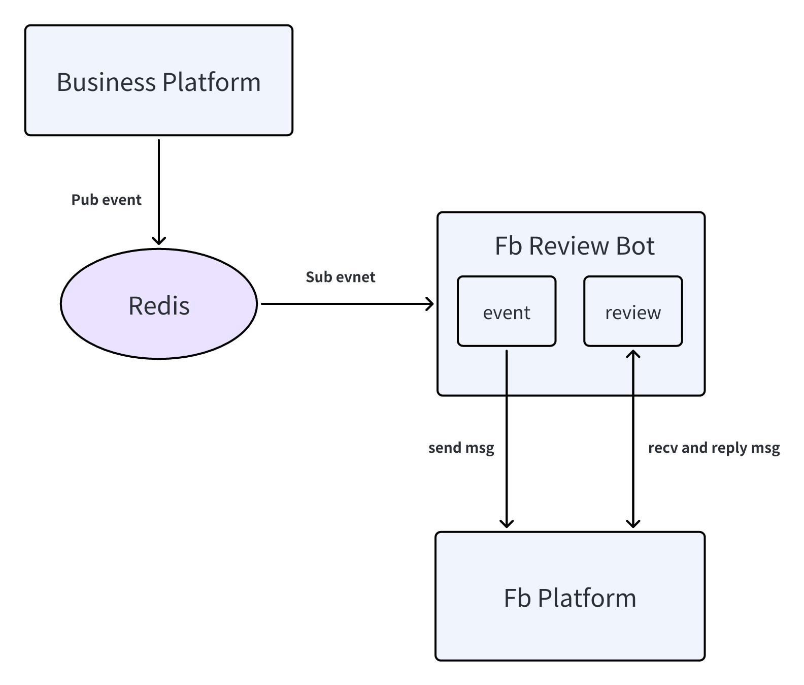

## FB Review Bot

### Directory Structure: 
```
/
├── api
├── internal
│   ├── cmd
│   ├── consts
│   ├── controller
│   ├── dao
│   ├── logic
│   ├── model
│   |   ├── do
│   │   └── entity
│   └── service
├── manifest
├── resource
├── utility
├── go.mod
└── main.go 
```

### Request Layered Flow


### Architecture



### database postgresql
#### reviews 
```sql
# review
CREATE TABLE review (
  id SERIAL PRIMARY KEY,
  customer_id VARCHAR(127),
  review_text VARCHAR,
  created BIGINT default 0,
  transaction_id VARCHAR(127)
);
CREATE INDEX idx_reviews_customer_id ON review (customer_id);
CREATE INDEX idx_reviews_created ON review (created);

# message template
CREATE TABLE message_template (
  template_id VARCHAR(127) PRIMARY KEY,
  template_name VARCHAR(127),
  template_content VARCHAR,
  variables JSONB
);
CREATE INDEX idx_template_id ON message_template (template_id);
```

